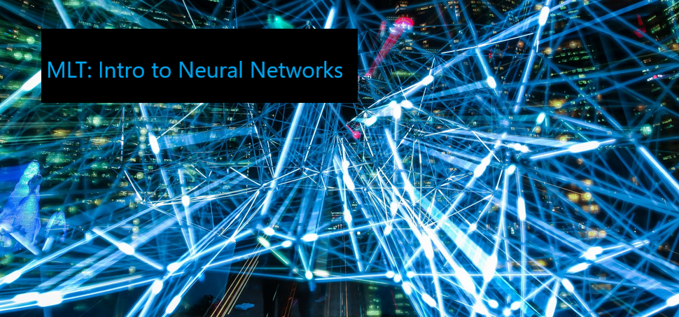

# Introduction to Neural Networks

This project serves as an introduction to **Neural Networks** for the uninitiated. The central aim here is to show users how to build neural networks from the ground up, using only standard Python and the _Numpy_ library, rather than an external machine learning framework (e.g, PyTorch, Tensorflow, scikit). In addition, there is a short paper that introduces networks and a simple overview of some of the associated mathematics with regards to a simple _feed-forward_ graph. I may well add to this paper in the future with some insight into why I believe neural networks are so effective.

Status: In progress. Pull requests, additions, and feedback are welcome from all.
Contact: jack.collins1@aviva.com
